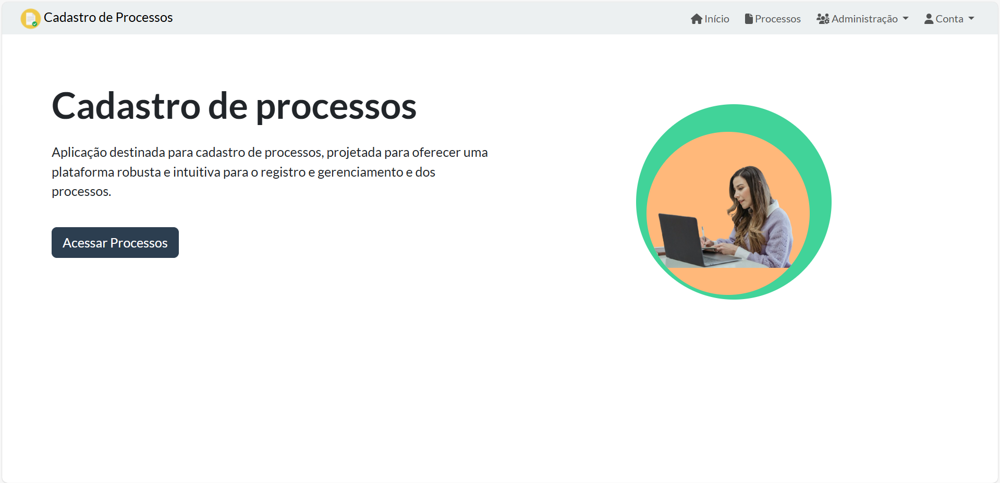
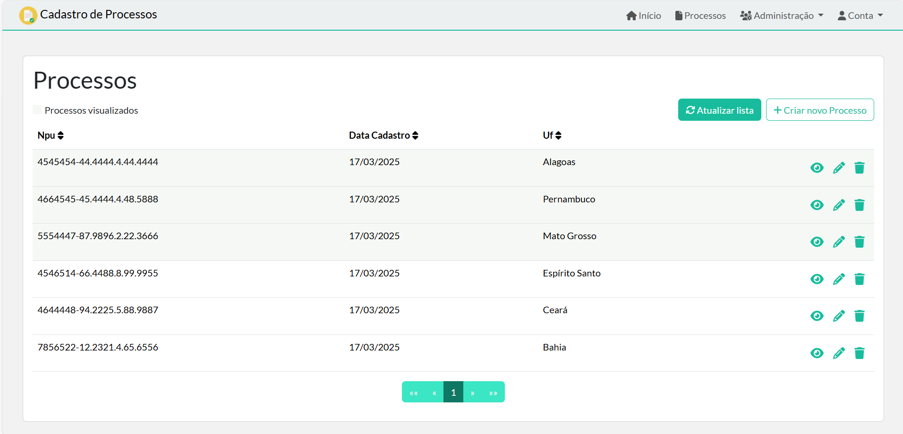
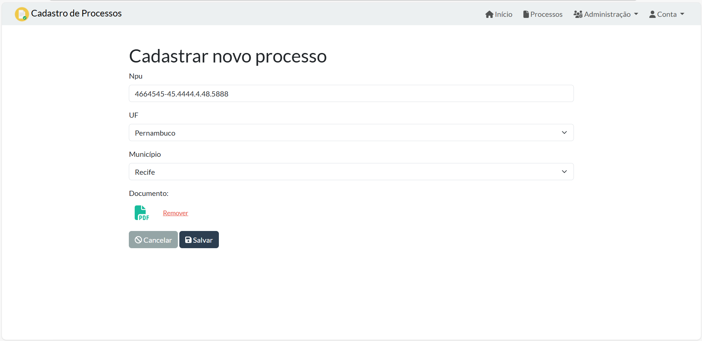
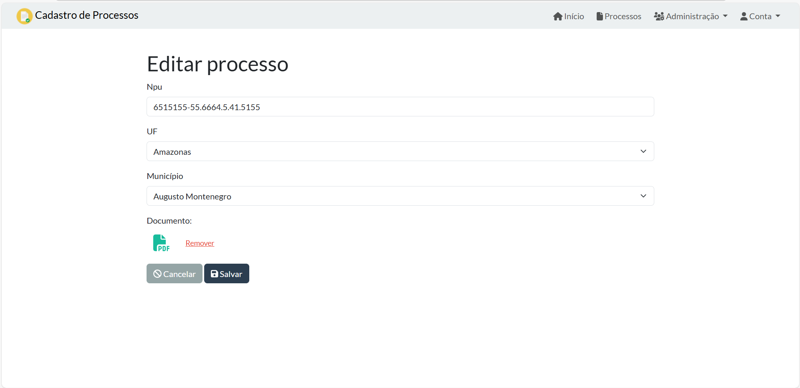
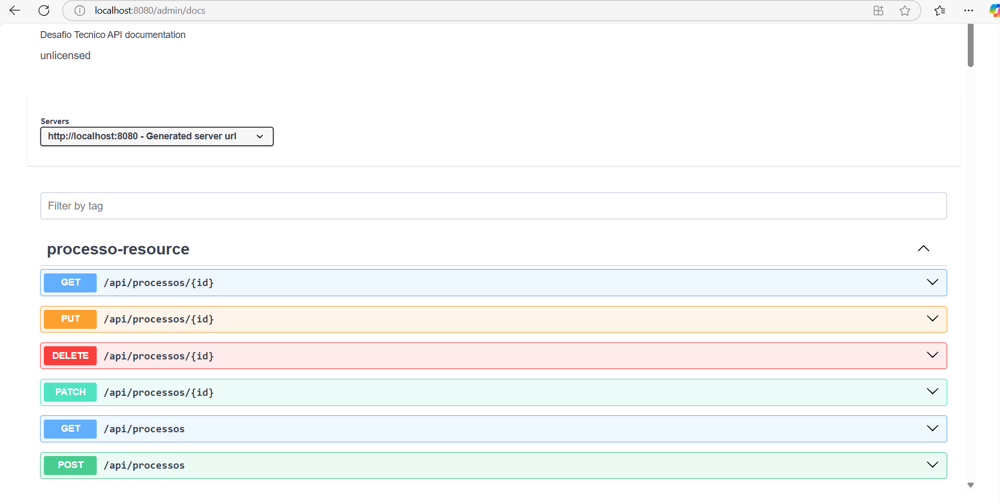

## 💻 Desafio Técnico - Cadastro de Processos
Este projeto foi desenvolvido como um desafio técnico, e reune backend (Java + Spring Boot) e frontend (Angular) em uma aplicação de cadastro de processos. A seguir, explico como executar o sistema e apresento algumas telas.

### Descrição Geral
Este sistema tem como objetivo gerenciar processos, oferecendo funcionalidades para criação, edição, listagem e exclusão de cada processo. Foi criado com JHipster e tanto o backend (Spring Boot) quanto o frontend (Angular) são iniciados simultaneamente ao rodar ./mvnw, de modo que:
É preciso Docker para subir os serviços necessários (banco de dados, etc.).
Após iniciado, a aplicação fica disponível em http://localhost:8080.

### Tecnologias Utilizadas
- Java
- Spring Boot
- Angular
- Docker
- Maven 
- Bootstrap

### Pré-requisitos
- Docker instalado 
- Java instalado

### Como Executar
- Clone ou baixe este repositório.
- Instale as dependências com `./npmw install`
- Execute a aplicação com: `./mvnw` Isso fará o Maven baixar dependências e iniciar o backend + frontend na porta http://localhost:8080
- Fazer login com 
  **User**: Admin 
 **Senha**: Admin

### Capturas de Tela

#### Home

**Figura 1**: Tela inicial, onde o usuário encontra um painel de boas-vindas.

---

#### Lista de Processos

**Figura 2**: Listagem de processos com opções para visualizar e editar.

---

#### Edição de Processo

**Figura 3**: Formulário para cadastro de um processo.

---
#### Cadastro de Processo

**Figura 4**: Formulário para edição dos dados de um processo.

---

#### Visualização de Processo

**Figura 5**: Página de detalhes do processo, exibindo todas as informações.

---

#### Swagger

**Figura 6**: Ferramenta integrada para documentação e testes da API.
